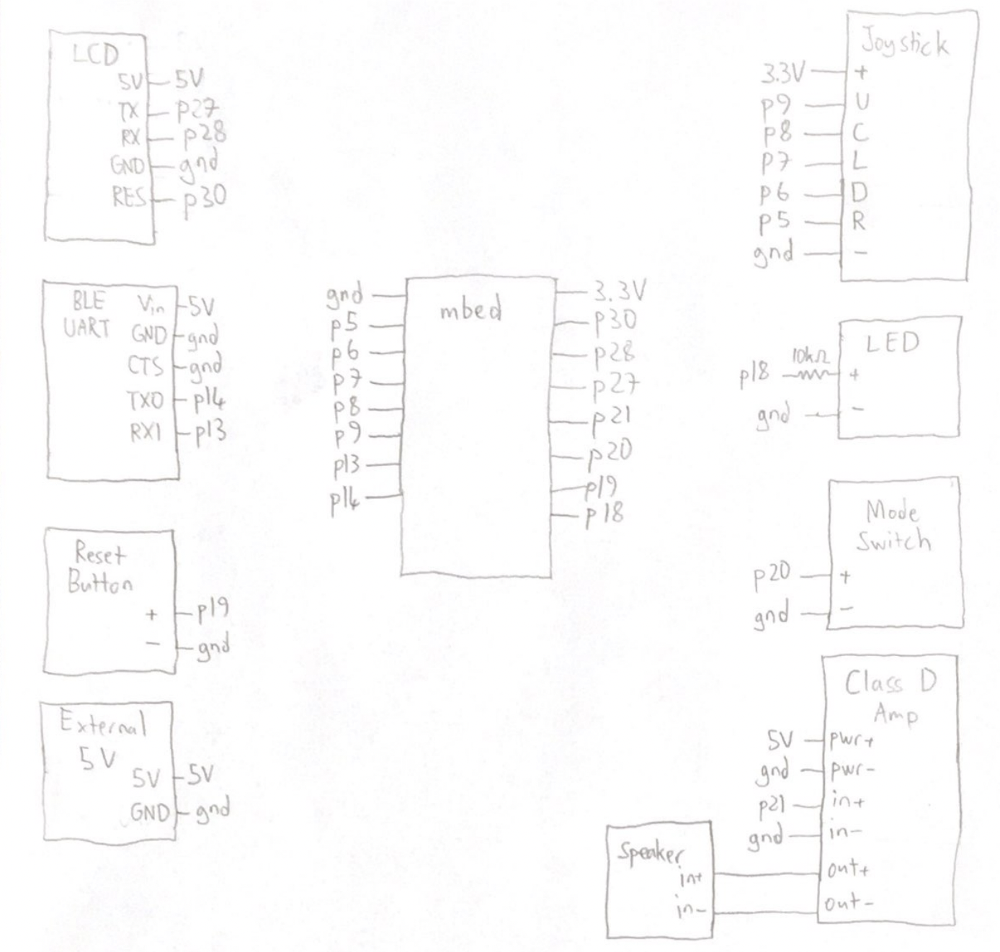
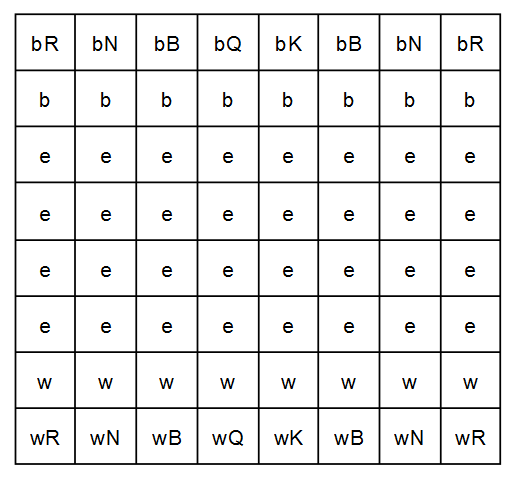
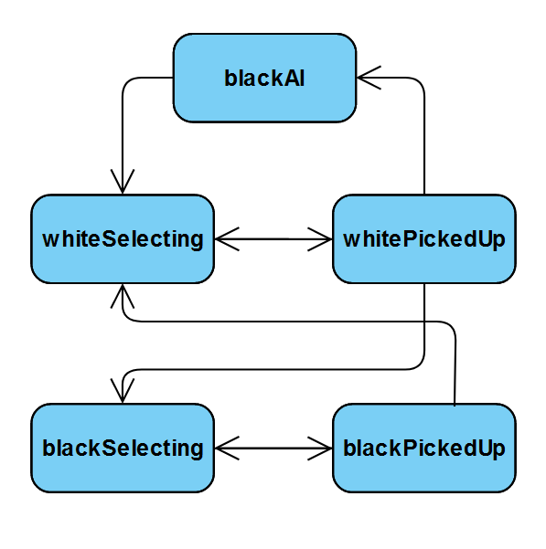
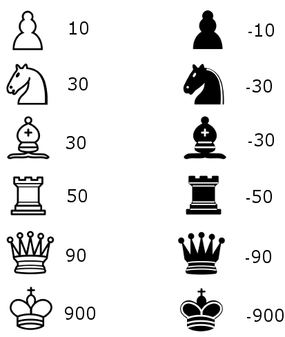

# Mbed Chess Game
An embedded chess game device with 1-player and 2-player functionality.

Team Members: Mert Us, and Matthew Hannay, Logan Starr

## Overview 
In this project we built a chess game using an mbed LPC1768 Microcontroller. The game includes a 2-player mode, as well as a 1-player mode in which the AI opponent is implemented using the Minimax Algorithm. Players have the ability to control the game using a joystick and a mobile app connected via bluetooth. The device is beginner-friendly, with possible moves highlighted on the screen when a piece is selected, and a red LED to indicate when a user attempts an illegal move. The game can be reset using a button or the bluetooth app, and the mode can be changed using an on-board switch. The game mode change takes effect after the game is reset. An LCD Screen is used to display the board and a speaker plays tunes when the game ends.

## Components List
* LPC1768 Mbed With Mbed OS 2
* uLCD-144-G2
* Adafruit Bluefruit BLE UART
* SparkFun Mono Audio Amp Breakout
* PCB Mount Speaker
* 5-Way Tactile Switch Breakout
* 8 Position DIP Switch
* Push Button
* Red LED
* 10k Ohm Resistor
* 5V Breadboard Power Supply

## Project Demo

## Schematic

## Software Design
### Classes
* __Nav_Switch__: Reads inputs from the 5-way tactile switch. Owned by ECE 4180 instructor Dr. James O. Hamblen.
* __BoardState__: Stores the state of the chess board and implement game moves such as moving and capturing pieces. The game board is implemented as an array of 64 characters. The method for calculating the utility of the board state for the AI opponent is in this class.
* __Gameboard__: Implemented as a wrapper around the BoardState class with the addition of rendering graphics for the LCD display and the game cursor. The Gameboard class includes sprites for images of pieces nad methods for selecting/unselecting squares during the game.

Initial game board with the names for pieces used in the code

### State Machine
The game process is implemented as a state machine with five states:
* __whiteSelecting__: This is the initial state of the game. Once the player selects a square with a white piece, possible moves by the piece are highlighted and the game advances to __whitePickedUp__. If the player tries to select a square without a white piece, the red LED flashes to warn the player of an illegal move.
* __whitePickedUp__: In this state, player decides what square to move the selected piece to. In order to unselect, they can select a square other than the possible moves by that piece, and the game will go back to __whiteSelecting__ state. Once the move is made, if the game is in 2-player mode, it advances to __blackSelecting__, else if the game is in 1-player mode it advances to __blackAI__. The game is implemented such that in 1-player mode, the player always controls white pieces.
* __blackSelecting__: The __blackSelecting__ state works the same as the __whiteSelecting__ state, but the player selects black pieces and advances the game to __blackPickedUp__.
* __blackPickedUp__: The same as the __whitePickedUp__ state, and advances back to __whiteSelecting__ once the move is finalized.
* __blackAI__: The program runs the Minimax Algorithm to decide the best move and once it makes the move, changes state to __whiteSelecting__.

### AI Implementation
The Minimax Algorithm is used by engines for various games such as chess and tic tac toe. It functions by assigning a numerical value to each possible state of the game and wowking to maximize the value of the game state for its benefit. It achieves this by looking ahead to all possible moves and building a tree. It makes a decision based on either maximizing the value of its move or minimizing the value of the opponent, hence the name minimax. A good summary of the algorithm can be found at https://www.youtube.com/watch?v=l-hh51ncgDI&t=343s. The efficiency of the algorithm is __O(n^m)__, with __n__ being the number of possible actions in the game and __m__ being the depth of the tree.

For our implementation, we were bounded by the real-time reponse constraints of our device, since the user cannot sit and wait for the AI to calculate the best move. After testing out different depth levels, the most feasible was level 3. Therefore, our in-game AI looks ahead to 3 moves to make the best decision.

#### How the utility of the board state is calculated
The algorithm scores different board states using information about what pieces are on the board and their locations. Since the AI control black pieces, the following values are inverted when used by the program so that it maximizes the output score:

## Other Peripherals
* __Red__ __LED:__ The LED has two conditions that cause it to flash:
1. If a player tries to select a square it cannot, such as an empty square
2. If a player tries to move outside of the boundaries of the game board
The case of the player choosing a square other than the possible moves after a piece is selected is not considered illegal, since it is used to unselect a piece.
* __Push__ __Button:__ The button on the board the game. The game can be reset at any time and the button should be pressed to start a new game after the old one ends as well.
* __DIP__ __Switch:__ The switch is used to choose between 1-player and 2-player modes. After switching the game mode, the user needs to reset to start a new game with the chosen game mode.
* __Speaker:__ The speaker plays a sound once a king captured and the game ends in order to celebrate the winner.
